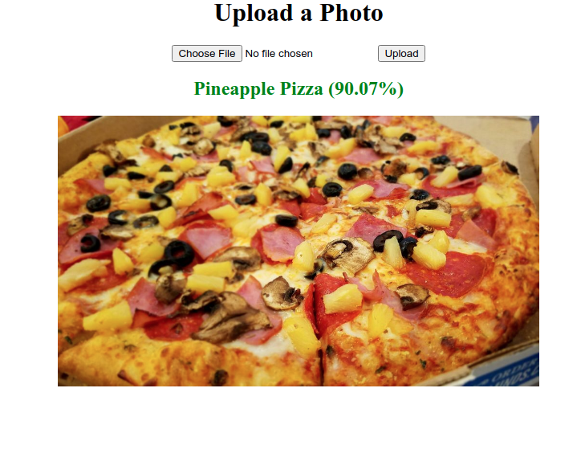
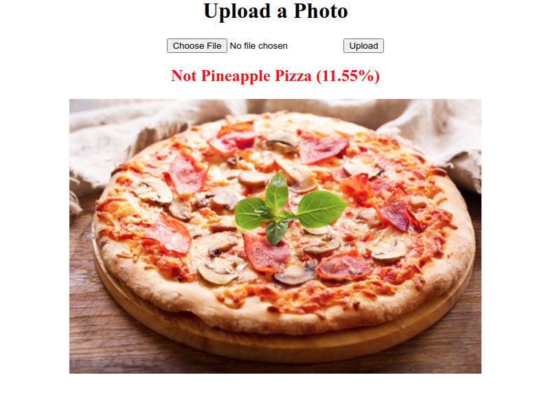

# is-pineapple-pizza

What would you say if I told you there is an app on the market that could tell whether your pizza has pineapple on it.

Convolutional neural network built with Keras. Uses PizzaGAN labeled dataset (see the scripts in dataset/). For better accuracy add more
 images of pineapple pizzas!

I got the idea from the Silicon Valley [not hotdog app](https://www.youtube.com/watch?v=vIci3C4JkL0).

## Training
1. Install tensorflow, `pip install -requirements.txt` and whatever it wants
2. Run `dataset/download_PizzaGAN.sh` to download their dataset (~2.8GB + unzipped)
3. Tweak the settings in the dataset/categorize.py script and run it
4. Download more images of pineapple pizzas in `dataset/training_set/pineapple` for better accuracy
5. Run the `classifier.py`/`classifier.ipynb` (for example with [jupyter](https://jupyter.org/) or IDE) and tart training

## Server
1. Install the requirements (same as above)
2. Start with `cd server && flash run`
3. Navigate to development server at http://127.0.0.1:5000/
 
